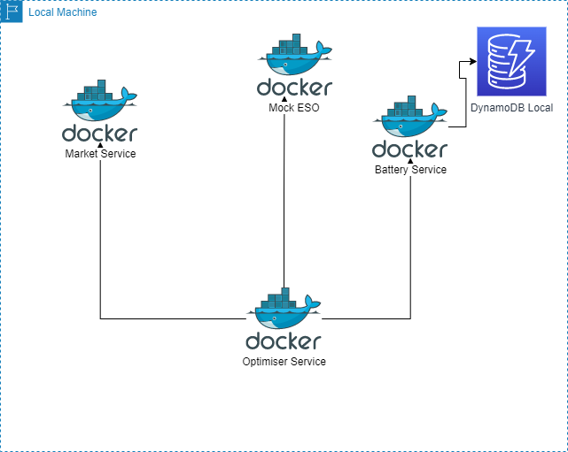
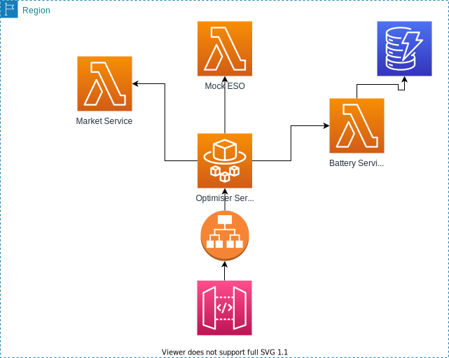

# Service

## Setup

1. Install Docker
2. clone Repo
3. In Repo root, `mkdir ./docker/dynamodb` && `chmod 777 ./docker/dynamodb`.
   This is necessary because a volume mount is setup to allow dynamo store state as .db file.
4. Spin Up all 4 services using `docker-compose up --build`

## Use

1. Retrieve the optimiser strategy for period using a request like:
   `curl http://localhost:5000/strategy?firstSettlementPeriodStart=INSERT_ISO_TIME_HERE&lastSettlementPeriodStart=INSERT_ISO_TIME_HERE`
   For example:

   ```
   curl http://localhost:5000/strategy?firstSettlementPeriodStart=2021-10-04T00:00:00&lastSettlementPeriodStart=2021-10-04T02:30:00
   ```

2. Check the response body from 1. for the optimisers submitted bid offer pairs.
3. The terminal shows a log of all key parameters. A log file will also be written to
   `docker/optimiser/logs/run_output.log` within the root of the project.

## Architecture

## Local Architecture



### Target AWS Architecture


